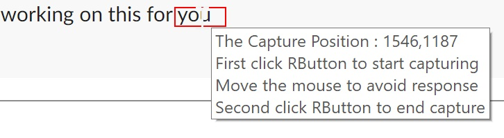
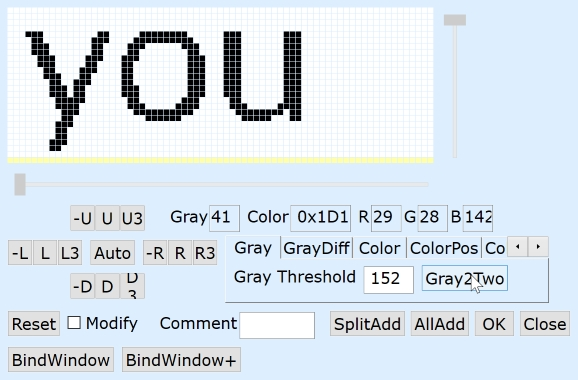
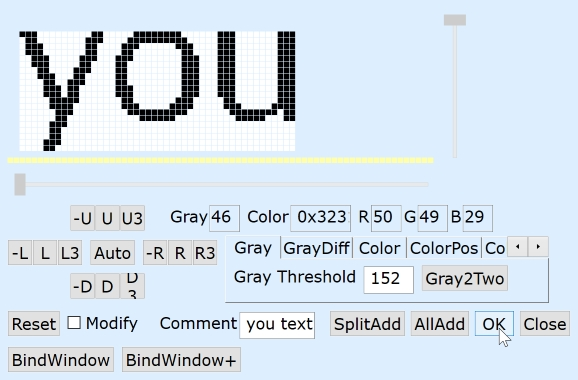

## Generating GraphicSearch Queries

Open graphicsearch_gui.ahk

 
Use "Capture" button and right click twice over the image your ahk script would like to find.

 

GraphicSearch works great on text or images. We'll use text for this example as it will have a stark difference between forground and background. The [tutorial](/tutorial) offers more image-centric examples.

 
After capture, your selected area will appear in an editing window.

 
Click somewhere on the foreground color, you can use GrayDiff or ColorDiff Tab to determine if the background should be determined by difference in grays or colors.

Here we use the Gray2Two button to automatically choose a gray Theshold of 152.

 
Use the controls on the left to trim the image down to a smaller area. Just like Imageseach; the smaller the image, the better chances there are to find a match.

Here we can use The "Auto" button since much of the capture area is background.

 
You may add a human readable tag and press "OK" to convert the capture into a GraphicSearch Query.

 
The string will be added to your clipboard and is presented below in the Gui with a sample script.

